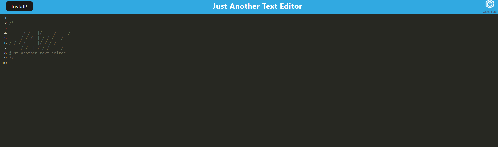

# Text Editor
No License Chosen
## Table of Contents 
- [Description](#description) 
- [Application Preview](#application-preview)
- [Installation](#installation)
- [Usage](#usage))
- [Test Instructions](#test-instructions)
- [Questions](#questions)
- [License](#license)

## Description
- A web application that can be used offline to create notes or code snippets without an internet connection.

## Application Preview

- https://text-editor-connor.herokuapp.com/

## Installation
- In browser

## Usage
- To create code snippets and notes in the browser

## Test Instructions
- Try it yourself!

## Contact Me:
- Github Username: FluffyKyubey 
- Github Link: https://github.com/FluffyKyubey  
- Email: john.alex.hull@gmail.com 

## License
- Copyright 2022 John Hull
 
